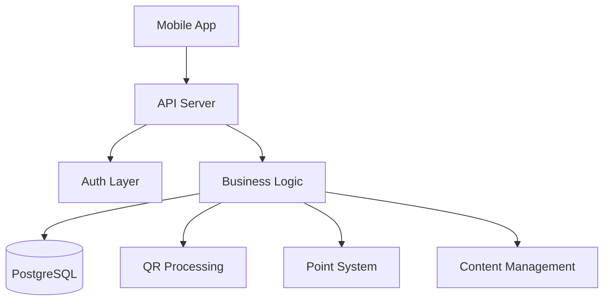
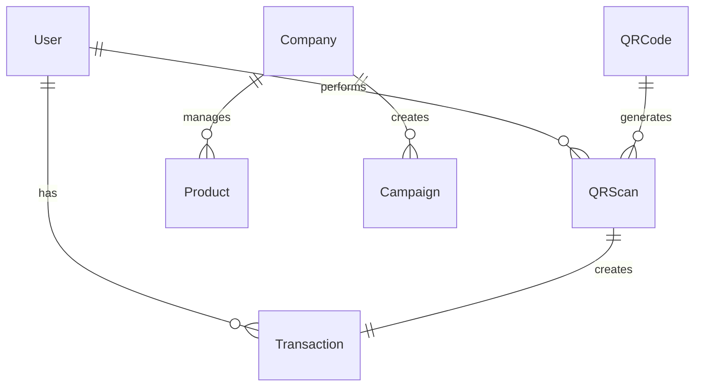

# NSP Auto Loyalty Program API

## System Overview
**NSP** is an automotive loyalty program enabling customers to earn points by scanning QR codes on products and redeem them for rewards. The system supports multiple user roles with role-based access control.

**Base URL**: `http://localhost:8080` | **Version**: 2.0.0 | **Database**: PostgreSQL

## User Roles
- **User** - Scan QR codes, earn points, view products/news
- **Company** - Manage own products, news, campaigns  
- **Operator** - Extended content management
- **Admin** - Full system control

## Authentication
**API Key**: `X-API-Key` header required for all endpoints  
**Bearer Token**: `Authorization: Bearer <token>` for protected endpoints  
**Session**: 30-day token expiration, SHA-256 password hashing

## System Architecture


## Data Flow


---

# API Endpoints by User Role

## 👤 All Users

### System Status
**GET** `/health` - System health check
```json
{"status": "healthy", "version": "2.0.0", "database": "connected"}
```

### Public Content
**GET** `/products` - Product catalog  
**GET** `/cars` - Car listings  
**GET** `/news` - Published news  
**GET** `/campaigns` - Active promotions

### Account Management
**POST** `/register` - Create account (gets 100 bonus points)
```json
{"name": "string", "email": "string", "password": "string", "userType": "individual|company"}
```

**POST** `/login` - User authentication
```json
{"email": "string", "password": "string"}
```

---

## 🎯 Regular Users
*Requires Bearer Token*

### QR Code Scanning
**POST** `/scan` - Scan QR code for points (one-time use)
```json
{"qr_code": "NSP:uuid:category:points", "location": "optional"}
```
Response: `{"valid": true, "points_earned": 50, "product_name": "Product"}`

**GET** `/user/scans` - Scan history with statistics
Response: `{"total_scans": 10, "total_points": 500, "scans": [...]}`

### Point Management
**GET** `/user/transactions` - Point transaction history
Response: `{"transactions": [{"type": "earned", "amount": 50, "description": "QR scan"}]}`

### Account Control
**DELETE** `/users/{user_id}` - Delete own account (admin can delete any)

---

## 🏢 Company Users
*All regular user functions plus:*

### Content Management
**POST** `/products` - Add products to catalog
```json
{"name": "string", "category": "string", "pointsCost": 100, "stockQuantity": 50}
```

**POST** `/news` - Publish news/promotions
```json
{"title": "string", "content": "string", "isImportant": false}
```

**POST** `/campaigns` - Create promotional campaigns
```json
{"title": "string", "campaignType": "discount", "startDate": "ISO8601", "endDate": "ISO8601"}
```

### Analytics
**GET** `/company/analytics` - Company performance metrics
Response: `{"products": {"total": 10}, "campaigns": {"active": 3}}`

### Content Control
**DELETE** `/products/{id}` - Remove own products  
**DELETE** `/news/{id}` - Remove own news  
**DELETE** `/campaigns/{id}` - Remove own campaigns

---

## ⚙️ Operator Users
*All company functions plus extended content management*

---

## 👑 Admin Users
*Full system access*

### System Management
**POST** `/cars` - Manage car catalog
```json
{"brand": "Toyota", "model": "Camry", "year": 2024, "price": "$30000"}
```

**DELETE** `/users/{id}` - Deactivate any user account  
**DELETE** `/cars/{id}` - Remove car listings  
**DELETE** `/products/{id}` - Remove any products  
**DELETE** `/news/{id}` - Remove any news  
**DELETE** `/campaigns/{id}` - Remove any campaigns


---

# Technical Reference

## Response Format
```json
{"success": true, "error": "string", "pagination": {"limit": 50, "offset": 0}}
```

## Key Data Types
**QR Code Format**: `NSP:uuid:category:points`  
**Authentication**: API Key + Bearer Token  
**IDs**: UUID strings  
**Dates**: ISO8601 format  
**Points**: Integer values  
**Pagination**: Default 50 items, max configurable

## HTTP Status Codes
**200** Success | **400** Bad Request | **401** Unauthorized | **403** Forbidden  
**404** Not Found | **409** Conflict (QR used) | **500** Server Error

## Security
- SHA-256 password hashing
- 30-day session tokens  
- Role-based access control
- Soft deletion (data preservation)
- API key validation required

## System Limits
- Registration bonus: 100 points
- Session duration: 30 days
- Default pagination: 50 items
- QR codes: One-time use only